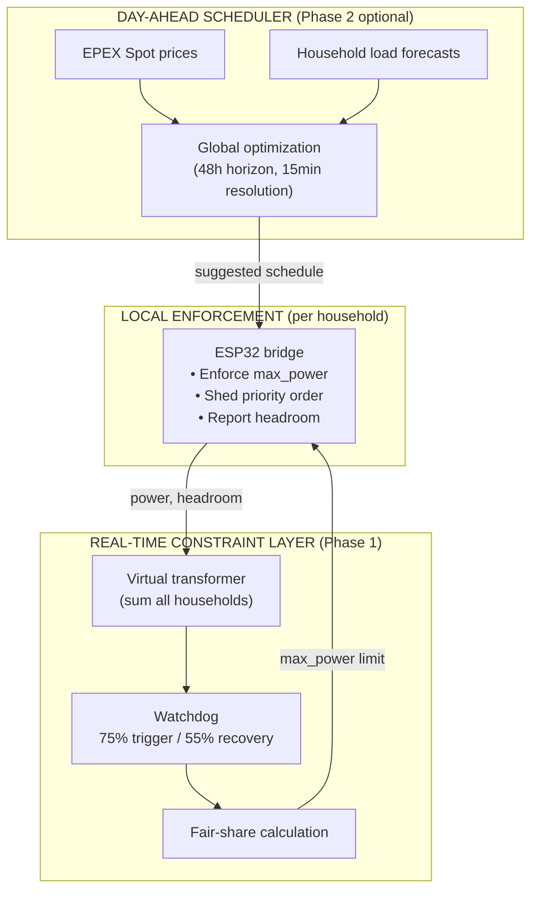

# LEM-Netz — Concept Brainstorming

**Status:** Pre-design, exploratory  
**Purpose:** Collect architectural approaches before committing to one  
**Input:** [LEM-Requirements.md](LEM-Requirements.md)

---

## Overview

This document enumerates distinct architectural approaches for the decentralized LEM-Netz system. Each approach must satisfy all requirements in `LEM-Requirements.md` — in particular **FR-03 (Decentralized Agents)**, **UC-03 (Offer/request flexibility)**, **FR-01 (Grid protection)**, and **FR-06 (Economic fairness)**.

All approaches share the same physical communication layer (LoRaWAN 868 MHz for household↔gateway, MQTT on LAN between gateway and central server) but differ in *how coordination happens*.

---

## A) Constraint-Based Coordination (centralized-decentralized hybrid)

The central system monitors the virtual transformer and broadcasts **constraints** per household (`max_power` limit, price signal). Each household agent optimizes independently within its envelope.

- Household agent knows its own tariff model and device priorities
- "Offer flexibility" means reporting available headroom or reduction capability
- Central system calculates fair shares during overload
- **Agent hardware:** ESP32 + LoRa (lightweight — only needs to enforce limits)
- **Pro:** Simple, proven, works on ESP32, low LoRaWAN bandwidth
- **Con:** Central system must estimate fair shares; less dynamic matching

---

## B) Fully Distributed Negotiation (peer-to-peer)

No central optimizer. Household agents negotiate directly via the MQTT bus (translated through LoRaWAN↔gateway).

- Agent A: "I can reduce 2 kW for 30 min, minimum price €0.08/kWh"
- Agent B: "I'll take it" (avoids buying grid power at €0.30/kWh)
- Central system only **vetoes** deals that would exceed the transformer limit
- **Agent hardware:** Requires more compute — RPi-class, not ESP32 alone
- **Pro:** Maximum autonomy, privacy, resilience; naturally satisfies FR-03
- **Con:** Complex protocol, higher per-household cost, latency challenges over LoRaWAN

---

## C) Market-Matched Auction (central coordinator)

Each household agent submits bids (flexibility offers) and asks (flexibility requests) to a central coordinator. The coordinator clears the market periodically (every 15 min).

- Auction clears at the price that matches supply to demand within transformer limits
- Results are broadcast as per-household schedules or constraints
- Non-binding: agents can deviate; watchdog overrides in real-time
- **Agent hardware:** ESP32 possible (simple bid submission), RPi preferred
- **Pro:** Transparent, economically efficient, fair allocation mechanism
- **Con:** More central logic, periodic (not continuous), households must estimate their bids

---

## D) Federated / Hierarchical

Neighborhood is split into micro-clusters (by street, building, or transformer branch). Each cluster has its own local coordinator.

- Cluster coordinators handle local matching, report aggregates upward
- Central system sees cluster totals only, not individual household data
- During overload, central system allocates capacity to clusters, clusters sub-allocate to households
- **Agent hardware:** ESP32 at household level + RPi per cluster as coordinator
- **Pro:** Scales well (1000+ households), privacy-preserving, multi-transformer support
- **Con:** Extra hardware per cluster, more complex routing, cluster assignment overhead

---

## E) Purely Event-Driven / Reactive

No proactive optimization. Household agents run independently. The central system does nothing unless the virtual transformer crosses a threshold.

- Normal operation: each household optimizes solo (e.g., EV charges at cheapest hours)
- On overload: central system tightens limits or sheds loads (two-stage watchdog)
- "Flexibility" is offered on-demand when asked
- **Agent hardware:** ESP32 (simple limit enforcer)
- **Pro:** Simplest possible, minimal central logic, maximum household autonomy
- **Con:** No proactive coordination; always reacting after the fact; leaves efficiency on the table

---

## F) Predictive Scheduler (day-ahead)

Central system collects 24h load/generation forecasts from each household agent. Runs a global optimization using EPEX Spot prices and transformer constraints. Produces a 24h schedule per household.

- Household agents follow the schedule but can deviate
- Real-time watchdog overrides if actual load breaches limits
- Requires households to communicate expected load/flexibility windows
- **Agent hardware:** RPi-class for forecast submission; ESP32 can receive but not generate forecasts
- **Pro:** Most globally efficient, can optimize across households and time
- **Con:** Requires forecasting infrastructure, central computation, household cooperation on load predictions

---

## G) Token / Ration-Based

Each household gets a time-varying energy budget (token) proportional to their fair share of transformer capacity. Total token supply = transformer limit.

- Households consume tokens when drawing power
- Unused tokens can be traded/sold to neighbors via MQTT
- Overload is mathematically impossible if tokens are enforced
- **Agent hardware:** ESP32 possible (track token balance, enforce locally)
- **Pro:** Inherent fairness guarantee, market-like without complex pricing
- **Con:** Requires token accounting ledger, households must understand and manage a budget, less flexible than price-based approaches

---

## Potential Hybrids

Most likely the final design will combine elements:

| Hybrid | Base | Adds |
|--------|------|------|
| **A+F** | Constraint-based (real-time) | Predictive scheduler as day-ahead optimization layer |
| **A+E+F** | Constraint-based | Predictive scheduler + reactive watchdog (three layers: plan → constrain → shed) |
| **C+E** | Auction (periodic) | Reactive override for real-time safety |
| **D+F** | Federated clusters | Predictive scheduler per cluster |
| **G+A** | Token rations | Constraint-based enforcement if tokens exhausted |

---

## Analysis & Evaluation

### Hardware Cost Reality Check

The per-household budget (€100–200 one-time) comfortably covers ESP32-based approaches. The hard constraint is the **central infrastructure (≤€300)**.

| Component | Cost | Notes |
|-----------|------|-------|
| ESP32 bridge (LoRa + IR + RS485) | ~€40–65/hh | Well under €200/hh budget |
| RPi 5 + LoRa concentrator hat (indoor) | ~€180–220 | Combined server+gateway — fits ≤€300 |
| Home Assistant Green (server only) | ~€145 | Needs a separate gateway |
| Dragino DLOS8N (outdoor gateway) | ~€225 | IP65, proven at moderate scale |
| Milesight UG67 (outdoor gateway) | ~€588 | Best range, 2000+ nodes, exceeds budget alone |

**Central gateway tension:** The UG67 alone exceeds the €300 target. The concept must either:
- Use an **indoor RPi + LoRa concentrator** (~€200 total) — fits budget, acceptable for pilot/small deployments
- Use a **Dragino DLOS8N** (€225) + RPi 5 (€80) = ~€305 — barely over, outdoor-rated
- **Acknowledge** that communities wanting an outdoor-rated gateway at proven scale will exceed the €300 target and decide consciously

Approaches requiring RPi per household (B, F, or RPi-based variants of others) are still within the €100–200/hh budget with LoRa, or cheaper without LoRa (using household WiFi), but introduce WiFi dependency and per-household maintenance burden.

### Multi-Dimension Comparison

| Approach | Cost fit | Simplicity | FR coverage | UC-03 fit | LoRaWAN load | Overall |
|---|---|---|---|---|---|---|
| **A** Constraint-based | ★★★★★ | ★★★★★ | ★★★★☆ | ★★★☆☆ | ★★★★★ | **★★★★★** |
| **B** Distributed negotiation | ★★★☆☆ | ★★☆☆☆ | ★★★★★ | ★★★★★ | ★★★☆☆ | ★★★☆☆ |
| **C** Market auction | ★★★★★ | ★★★☆☆ | ★★★★☆ | ★★★★★ | ★★★★★ | ★★★★☆ |
| **D** Federated | ★★★★☆ | ★★★☆☆ | ★★★★☆ | ★★★☆☆ | ★★★★★ | ★★★☆☆ |
| **E** Event-driven | ★★★★★ | ★★★★★ | ★★☆☆☆ | ★☆☆☆☆ | ★★★★★ | ★★☆☆☆ |
| **F** Predictive standalone | ★★★☆☆ | ★★★☆☆ | ★★★☆☆ | ★★☆☆☆ | ★★★★☆ | ★★★☆☆ |
| **G** Token/ration | ★★★★★ | ★★☆☆☆ | ★★★★☆ | ★★★★☆ | ★★★★☆ | ★★★☆☆ |

### Detailed Evaluation

#### A) Constraint-Based — strongest candidate
- **Cost:** ESP32 bridge €40–65/hh ✓. Central: RPi+concentrator ~€200 ✓
- **Simplicity:** High. Flash ESP32 once, LoRaWAN OTAA join, done. No per-household network config
- **FR-03 Agents:** ESP32 enforces limits locally, reports spare capacity. Real optimization runs on the household's own devices (wallbox, battery BMS). Adequate
- **FR-06 Fairness:** During overload → proportional fair-share reduction. Normal operation → each agent only acts when it benefits its own tariff. No household can be harmed by an action it chose
- **UC-03 Flexibility:** ESP32 computes `headroom = max_power - current_load` in every uplink. Not a full bid, but the coordinator sees available capacity each cycle
- **UC-04 Shed priority:** Firmware encodes the fixed order (EV wallbox → battery → heat pump)
- **Offline:** ESP32 enforces last known limit; HA runs fully local
- **Limitation:** True flexibility "offer/request" is reporting headroom rather than negotiation. The central system decides allocation, not households

#### C) Market-Matched Auction — strong, but needs fairness overlay
- **Cost:** Same as A ✓
- **Simplicity:** Medium. Auction logic on HA is non-trivial, but households only send a single numeric bid
- **UC-03 Fit:** Natural fit — ESP32 sends "willing to pay €0.12/kWh for 2 kW"
- **⚠ Fairness risk:** Auction favors households with flexible price signals. Fixed-tariff households (no PV) cannot respond to price — could systematically lose. Needs a fairness overlay (e.g., a default allocation that households can trade but not lose)
- **Period mismatch:** 15-min auction × LoRaWAN downlink latency = coarse. A household's load can change completely before the next clearing

#### B) Distributed Negotiation — powerful, wrong fit for this project
- **Cost:** RPi ~€30–40/hh with WiFi (no gateway needed → central just HA Green €145). Or RPi+LoRa ~€50–70/hh + UG67 ✗
- **Simplicity:** Low. RPi per household: OS management, updates, SD card risk, WiFi stability, VPN/Tailscale to reach central HA
- **Offline:** With WiFi, depends on internet. Without internet, agent runs locally but cannot negotiate
- **Verdict:** Technically capable but wrong fit for a low-complexity, low-cost community project

#### E) Purely Event-Driven — simplest, but misses requirements
- **Cost & simplicity:** Best in class ✓
- **FR-03:** Weak — agent is passive during normal operation
- **UC-03/UC-04:** ✗ No proactive offers, no proactive coordination. Only reacts when limits are breached
- **Verdict:** Only viable if requirements are relaxed

#### D, F, G — Special Cases
| Approach | Verdict |
|---|---|
| **D (Federated)** | Overkill for <100 households. Viable at 500–1000+ scale. Adds ~€5–8/hh for cluster RPi |
| **F (Predictive)** | Best as a central add-on to A, not standalone. Central scheduler on HA adds no per-household cost. Household agent just receives schedules |
| **G (Token)** | Fair, but token accounting adds complexity. Households managing budgets works against the "simple" goal. Needs a central ledger |

---

## Recommended Hybrid: A + Central Scheduler (A+F)

The strongest design combines three layers that map directly to the two phases:

| Layer | Phase | What it does | Runs on |
|---|---|---|---|
| **Local enforcement** | 1 | Enforce `max_power` limit, shed in priority order, report headroom every 2 min | ESP32 bridge (each household) |
| **Real-time constraints** | 1 | Monitor virtual transformer, broadcast limits per household, fair-share reduction during overload | Central HA |
| **Day-ahead scheduler** | 2 (optional) | Global optimization with EPEX prices + transformer constraint → suggested schedules per household | Central HA (HAEO or similar) |

**Why this wins:**
- **Hardware reuse:** ESP32 bridge from Phase 1 works unchanged in Phase 2. No upgrade cost
- **Cost fits:** ESP32 €40–65/hh ✓. Central RPi+concentrator ~€200 ✓
- **Safety guarantee:** Constraint layer is the hard enforcement. The scheduler can only suggest — it cannot override the watchdog
- **Optional complexity:** Communities skip the scheduler and still have a working, fair system
- **Fairness:** The scheduler runs a constrained optimization where each household's tariff model is a parameter. It only schedules actions that benefit (or at least do not harm) each household versus their no-system baseline. The constraint layer applies proportional fair-share to everyone equally

---

## Decision Matrix

### Kill Criteria (hard vetoes)

| Criterion | Approaches that fail |
|---|---|
| Must run on ESP32-class hardware (or central cost exceeds €300) | **B** (RPi per household + gateway → ~€700–800 central) |
| Must satisfy FR-03 (decentralized autonomous agent) | **E** (passive agent), **F** standalone (follows central schedule, not autonomous) |
| Must satisfy FR-04 (local coordination) | **E** (only reactive, no proactive coordination) |
| Must operate offline | **B** (WiFi version depends on internet) |

**Surviving approaches:** A, C, D, G, A+F hybrid

### Weighted Scoring (1–5 per criterion)

| # | Criterion | Weight | **A** | **C** | **D** | **G** | **A+F** |
|---|---|---|---|---|---|---|---|
| 1 | Per-household cost (€100–200) | 15 | 5 | 5 | 4 | 5 | 5 |
| 2 | Central cost ≤€300 | 10 | 5 | 5 | 5 | 5 | 5 |
| 3 | Simplicity / easy install | 15 | 5 | 3 | 3 | 2 | 4 |
| 4 | FR-01 Grid protection | 10 | 5 | 4 | 4 | 5 | 5 |
| 5 | FR-03 Decentralized agents | 10 | 4 | 4 | 3 | 3 | 4 |
| 6 | FR-04 Local coordination | 8 | 4 | 5 | 4 | 4 | 5 |
| 7 | FR-05 Simple onboarding | 8 | 5 | 4 | 3 | 3 | 5 |
| 8 | FR-06 Economic fairness | 8 | 3 | 3 | 4 | 5 | 4 |
| 9 | FR-07 §14a support | 5 | 4 | 4 | 4 | 4 | 5 |
| 10 | UC-03 Offer/request flex | 5 | 3 | 5 | 3 | 4 | 4 |
| 11 | Offline capability | 5 | 5 | 5 | 5 | 5 | 5 |
| 12 | Low maintenance (community) | 5 | 5 | 4 | 3 | 3 | 4 |
| 13 | Scalability (100–1000 hh) | 3 | 3 | 3 | 5 | 3 | 3 |
| 14 | Hardware reuse Phase 1→2 | 3 | 5 | 5 | 4 | 4 | 5 |

### Weighted Totals

| Approach | Raw score | Max possible | % |
|---|---|---|---|
| **A+F** (Constraint + Scheduler) | **4.52** | 5.00 | **90%** |
| **A** (Constraint-based) | 4.33 | 5.00 | 87% |
| **C** (Market auction) | 4.07 | 5.00 | 81% |
| **D** (Federated) | 3.72 | 5.00 | 74% |
| **G** (Token/ration) | 3.87 | 5.00 | 77% |

**Clear winner: A+F.** A alone is close second, but the scheduler add-on improves FR-04, UC-03, and FR-07 at zero extra per-household cost since it runs centrally.

### Sensitivity Check

Changing weights shifts rankings only at extremes:

- **If fairness is weighted highest** (20+): G jumps to #2 behind A+F
- **If simplicity is weighted highest** (20+): A and A+F still lead, C drops
- **If UC-03 flexibility is weighted highest** (20+): C ties A+F

No scenario puts D or G ahead of A+F on total score. The hybrid delivers the best balance across all criteria.

---

## Open Questions (to resolve before writing the concept)

1. **Central gateway decision:** Indoor RPi+concentrator (≤€300), Dragino (~€305), or flexible (both options documented)?
2. **Forecast mechanism for scheduler:** How do households communicate expected load to the central scheduler? Simple weekly config form? Auto-learning from historical data?
3. **Fairness knob specifics:** Do households opt in/out of optimization per device, or per time window? What does "visibility into financial impact" look like in the UI?
4. **Bridge firmware:** One firmware for all household types (configurable via LoRaWAN downlink), or per-type variants?

---

## Next Step

Develop the hybrid **A+F (Constraint-Based + Central Scheduler)** into a full technical concept document aligned with [LEM-Requirements.md](LEM-Requirements.md).
